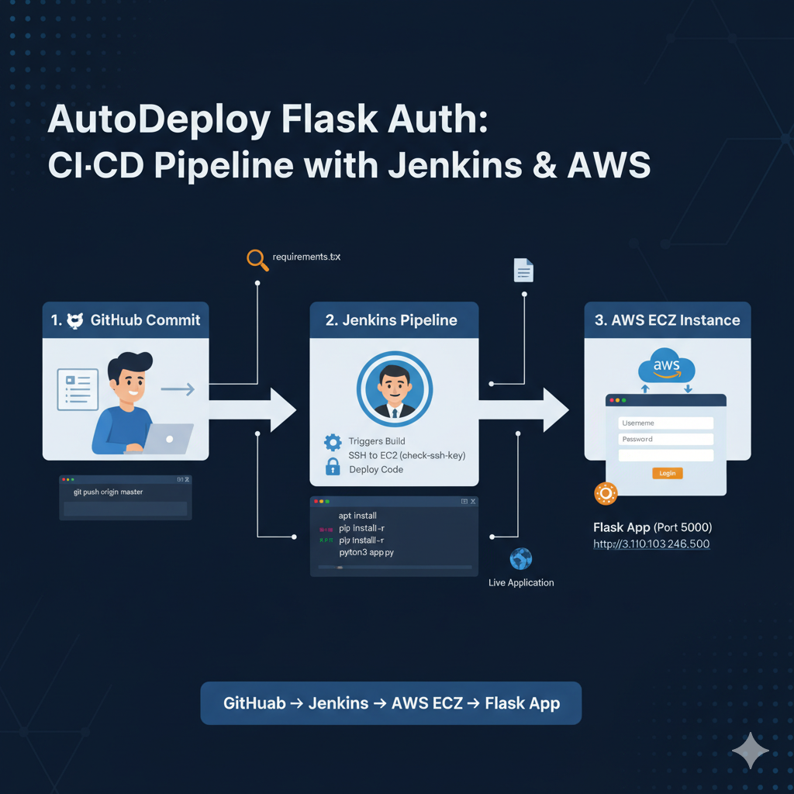
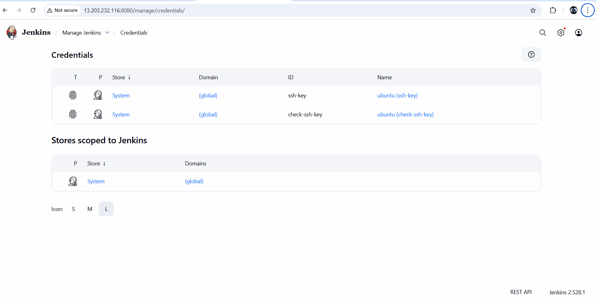
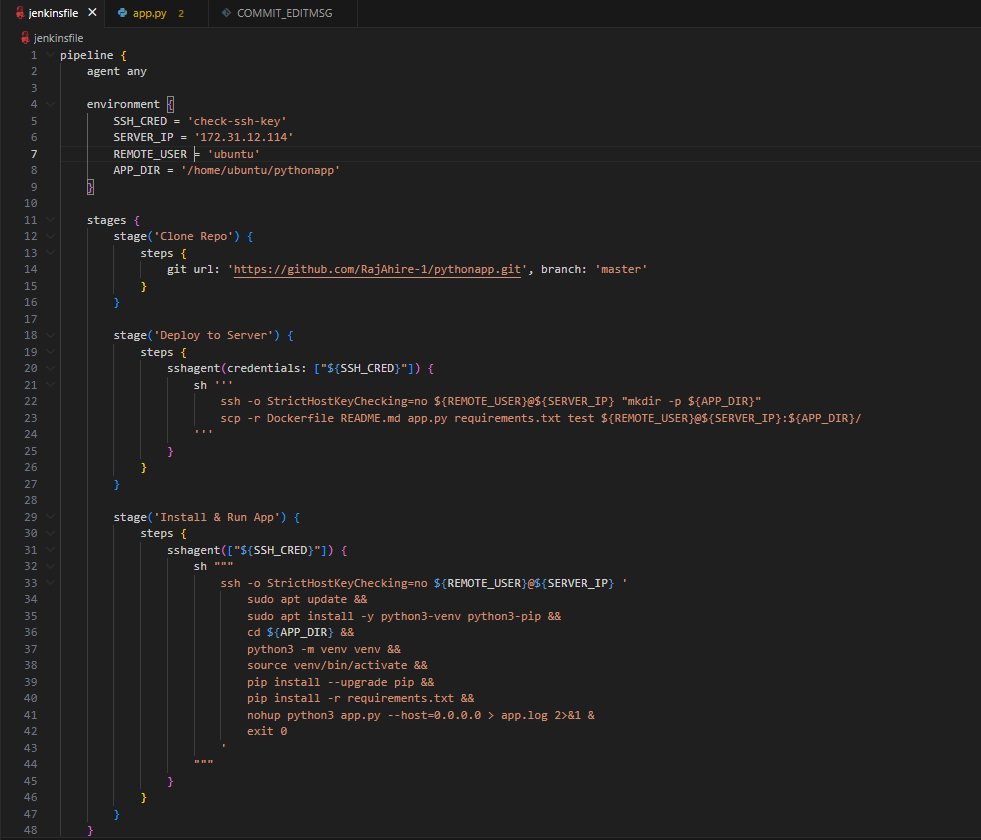
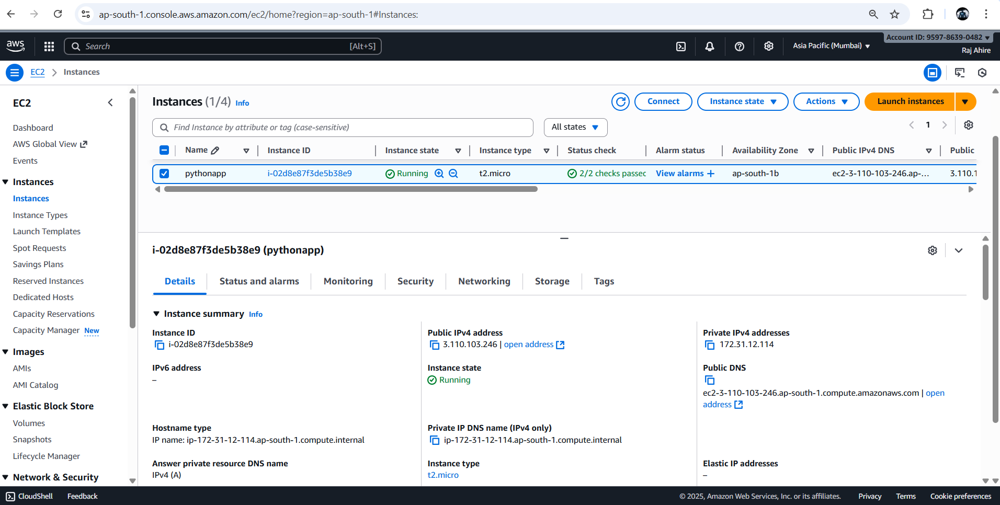
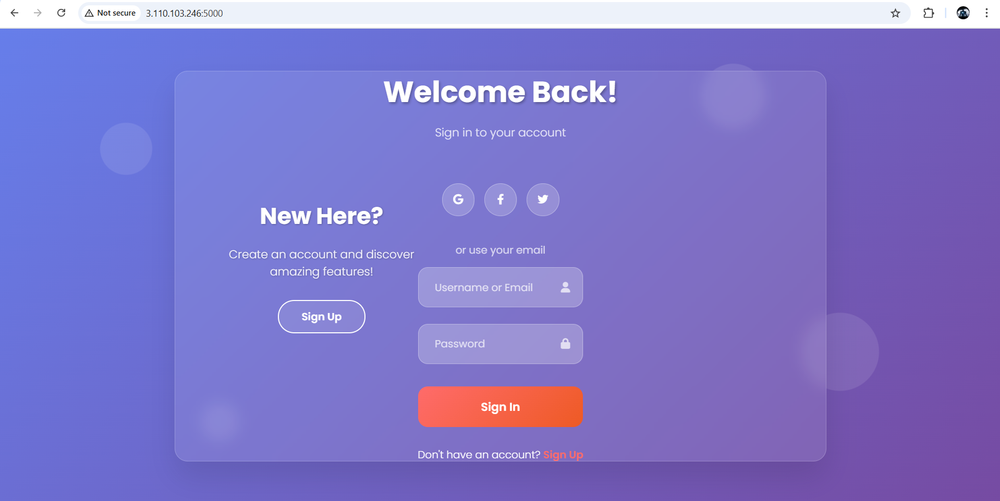

# AutoDeploy Flask Auth: CI/CD Pipeline with Jenkins & AWS

**Continuous Integration & Deployment using Jenkins, GitHub & AWS EC2**

---

## Project Overview

A fully automated CI/CD pipeline that deploys a **Flask-based Login/Signup application** to an AWS EC2 instance using **Jenkins**.
Every GitHub commit triggers Jenkins to pull the latest code, deploy it to EC2, install dependencies, and restart the Flask app automatically.



---

## Live Application

**URL:** [http://3.110.103.246:5000](http://3.110.103.246:5000)

---

## Architecture Overview

**GitHub → Jenkins → AWS EC2 → Flask App (Port 5000)**

* Developer pushes code to GitHub
* Jenkins automatically triggers pipeline
* Jenkins connects to EC2 via SSH
* EC2 deploys latest version and runs Flask app

---

## Tech Stack

| Component                | Technology             |
| ------------------------ | ---------------------- |
| **Backend**              | Python Flask           |
| **Frontend**             | HTML, CSS, JavaScript  |
| **CI/CD**                | Jenkins                |
| **Cloud Infrastructure** | AWS EC2 (Ubuntu 22.04) |
| **Version Control**      | GitHub                 |

---

## CI/CD Workflow

### 1. Development & Git Versioning

```bash
git add .
git commit -m "Updated Flask app"
git push origin master
```

### 2. Jenkins Pipeline Execution

* Pulls latest GitHub commit
* Copies files to EC2 via SSH
* Installs dependencies (`requirements.txt`)
* Starts Flask server in background

---

## Jenkins Configuration

### Credentials Setup

Go to: `Manage Jenkins → Credentials → System → Global credentials`

Add:

* **Kind:** SSH Username with private key
* **ID:** `check-ssh-key`
* **Username:** `ubuntu`
* **Private Key:** (EC2 key content)



---

### Pipeline Configuration

**Jenkinsfile**

```groovy
pipeline {
    agent any

    environment {
        SSH_CRED = 'check-ssh-key'
        SERVER_IP = '172.31.12.114'
        REMOTE_USER = 'ubuntu'
        APP_DIR = '/home/ubuntu/pythonapp'
    }

    stages {
        stage('Clone Repo') {
            steps {
                git url: 'https://github.com/RajAhire-1/pythonapp.git', branch: 'master'
            }
        }

        stage('Deploy to Server') {
            steps {
                sshagent(credentials: ["${SSH_CRED}"]) {
                    sh '''
                        ssh -o StrictHostKeyChecking=no ${REMOTE_USER}@${SERVER_IP} "mkdir -p ${APP_DIR}"
                        scp -r Dockerfile README.md app.py requirements.txt templates static ${REMOTE_USER}@${SERVER_IP}:${APP_DIR}/
                    '''
                }
            }
        }

        stage('Install & Run App') {
            steps {
                sshagent(["${SSH_CRED}"]) {
                    sh '''
                        ssh -o StrictHostKeyChecking=no ${REMOTE_USER}@${SERVER_IP} '
                            sudo apt update -y &&
                            sudo apt install -y python3 python3-venv python3-pip &&
                            cd ${APP_DIR} &&
                            python3 -m venv venv &&
                            source venv/bin/activate &&
                            pip install --upgrade pip &&
                            pip install -r requirements.txt &&
                            nohup python3 app.py --host=0.0.0.0 --port=5000 > app.log 2>&1 &
                        '
                    '''
                }
            }
        }
    }

    post {
        success {
            echo "Deployment successful! Visit: http://3.110.103.246:5000"
        }
        failure {
            echo "Deployment failed. Check Jenkins logs."
        }
    }
}
```



---

## Application Details

### Project Structure

```
pythonapp/
├── app.py               # Flask Application
├── requirements.txt     # Dependencies
├── test/                # Unit Tests
├── Jenkinsfile          # CI/CD Pipeline
└── README.md            # Documentation
```

---

## AWS EC2 Configuration

* **Instance Name:** `pythonapp`
* **Type:** `t2.micro`
* **Region:** `ap-south-1 (Mumbai)`
* **Public IP:** `3.110.103.246`
* **Private IP:** `172.31.12.114`



---

## Flask Application UI

### Login Page



---

## Key Features

* Fully Automated Deployment Pipeline
* Secure Login & Signup with Password Hashing
* SQLite Database for User Storage
* Modern Animated UI
* Continuous Integration with Jenkins
* AWS EC2 Cloud Hosting

---

## Workflow Summary

1. Developer commits & pushes code to GitHub
2. Jenkins auto-triggers build pipeline
3. Jenkins SSHs into EC2, deploys latest code
4. Flask app restarts automatically
5. Application accessible globally on port 5000

---

## Logs & Debug

To check logs on EC2:

```bash
cd /home/ubuntu/pythonapp
cat app.log
```
---

## Contact

**Raj Ahire**
Email: [rajahire326@gmail.com](mailto:rajahire326@gmail.com)
GitHub: [https://github.com/RajAhire-1](https://github.com/RajAhire-1)


